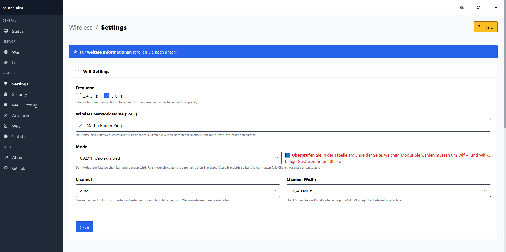

# [Router-Sim](https://github.com/jomaway/router-sim)

Router-Sim is an educational simulation of a routers webinterface.
It is based on [Admin One Tailwind Vue](https://justboil.me/tailwind-admin-templates/free-vue-dashboard/) by [JustBoil](https://justboil.me/)

## Demo

[Demo](https://jomaway.github.io/router-sim)

## Build and run

Get the repo by cloning this repo or download the zip file.
`cd` to the project's dir and run `npm install`
then run `npm run build` or `npm run build:vite`. 
Copy dist folder to your webserver.

## Licensing

- Licensed under MIT

## About

I started this projet for a lesson with the topic *Setting up WLAN access*.

The purpose was to give my students the opportunity to config the router without needing much hardware.
